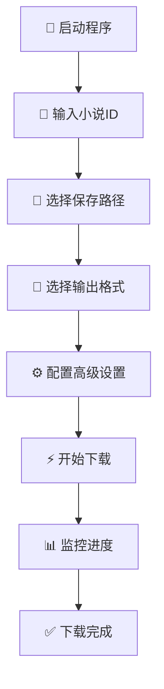
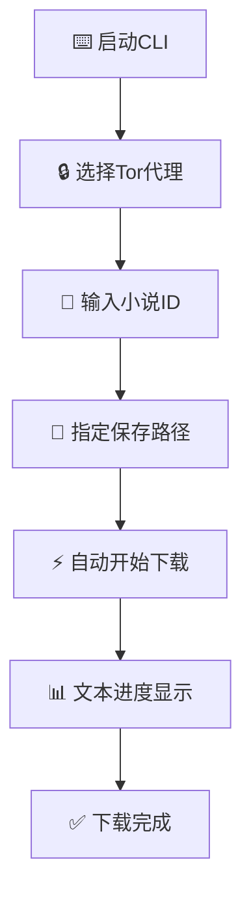

<div align="center">

# 🍅 番茄小说下载器 Pro


### 🚀 现代化智能小说下载工具

*集成GUI界面 • 搜索功能 • 多格式输出 • 网络代理 • 断点续传 • 增强信息*

<br>

[](https://github.com/POf-L/Fanqie-novel-Downloader/releases)
[](https://github.com/POf-L/Fanqie-novel-Downloader/wiki)
[](https://github.com/POf-L/Fanqie-novel-Downloader/issues)

<br>

```bash
# 🚀 一键启动
git clone https://github.com/POf-L/Fanqie-novel-Downloader.git
cd Fanqie-novel-Downloader
pip install -r requirements.txt
python main.py
```

</div>

---

## ✨ 核心亮点

<div align="center">

### 🎯 为什么选择番茄小说下载器 Pro？

</div>

<table>
<tr>
<td width="50%">

### 🖥️ **现代化界面**
- 🎨 **深色主题设计** - 护眼舒适的视觉体验
- 📱 **响应式布局** - 自适应各种屏幕尺寸
- 🔧 **分页式设置** - 直观的配置管理界面
- 📊 **实时监控** - 进度条、状态指示、日志显示

### ⚡ **智能下载引擎**
- 🚀 **批量下载** - 290章/批次，极速下载
- 🔄 **断点续传** - 支持暂停恢复，避免重复
- 🌐 **多API源** - 自动切换，确保稳定性
- 🎯 **智能重试** - 失败自动重试，成功率更高

</td>
<td width="50%">

### 🛡️ **网络安全**
- 🔒 **Tor代理支持** - 匿名下载，保护隐私
- 🌍 **CF Workers反代** - 突破网络限制
- 🔐 **加密传输** - AES加密，数据安全
- 🛠️ **智能回退** - 多层网络保障

### 📚 **格式支持**
- 📝 **TXT格式** - 兼容性强，通用性好
- 📖 **EPUB格式** - 电子书标准，阅读体验佳
- 🎨 **智能格式化** - 自动处理章节和内容
- 💾 **自动保存** - 实时保存，防止丢失

</td>
</tr>
</table>

---

## 🚀 功能展示

<div align="center">

| 功能模块 | 描述 | 状态 |
|:--------:|:-----|:----:|
| 🖥️ **GUI界面** | 基于CustomTkinter的现代化界面 | ✅ 完成 |
| 🔍 **智能搜索** | 书名搜索，智能匹配小说信息 | ✅ 完成 |
| ⚡ **批量下载** | 支持290章/批次的高速下载 | ✅ 完成 |
| 📚 **增强信息** | 详细书籍信息，封面，分类标签 | ✅ 完成 |
| 🔒 **Tor代理** | 内置Tor网络支持，保护隐私 | ✅ 完成 |
| 🌍 **CF反代** | Cloudflare Workers反向代理 | ✅ 完成 |
| 📖 **EPUB输出** | 标准电子书格式生成，含封面 | ✅ 完成 |
| 🔄 **断点续传** | 智能恢复下载进度，独立状态文件 | ✅ 完成 |
| 📊 **实时监控** | 详细的下载状态显示 | ✅ 完成 |
| 🔧 **自动更新** | GitHub Releases自动检查 | ✅ 完成 |

</div>

---

## 🚀 快速开始

<div align="center">

### 📋 系统要求

</div>

<table align="center">
<tr>
<td align="center">

**🐍 Python**<br>
`3.8+`

</td>
<td align="center">

**💻 操作系统**<br>
`Windows 10+`<br>
`macOS 10.14+`<br>
`Linux`

</td>
<td align="center">

**💾 内存**<br>
`512MB+`

</td>
<td align="center">

**🌐 网络**<br>
`稳定连接`

</td>
</tr>
</table>

---

### ⚙️ 三步安装

<div align="center">


</div>

#### **步骤 1️⃣：获取源码**
```bash
git clone https://github.com/POf-L/Fanqie-novel-Downloader.git
cd Fanqie-novel-Downloader
```

#### **步骤 2️⃣：安装依赖**
```bash
# 🌍 国际用户
pip install -r requirements.txt

# 🇨🇳 中国用户（推荐）
pip install -r requirements.txt -i https://pypi.tuna.tsinghua.edu.cn/simple/
```

#### **步骤 3️⃣：启动程序**

<table>
<tr>
<td width="50%">

**🖥️ GUI版本（推荐）**
```bash
python main.py
```
✨ 现代化界面，操作简单

</td>
<td width="50%">

**⌨️ 命令行版本**
```bash
python cli.py
```
🔧 轻量级，适合服务器使用

</td>
</tr>
</table>

> 💡 **小贴士**：tkinter是Python标准库，无需单独安装。如遇问题请确保Python安装时包含了tkinter组件。

---

## 📖 使用指南

<div align="center">

### 🎯 两种使用方式，满足不同需求

</div>

<table>
<tr>
<td width="50%">

### 🖥️ **GUI界面版本**

<div align="center">

**🎨 现代化图形界面，操作简单直观**

</div>

#### **🚀 启动程序**
```bash
python main.py
```

#### **📝 操作流程**



#### **✨ 功能特色**
- 🎨 **深色主题** - 护眼舒适
- 📊 **实时监控** - 进度可视化
- ⚙️ **分页设置** - 配置更直观
- 💾 **智能记忆** - 自动保存偏好

</td>
<td width="50%">

### ⌨️ **命令行版本**

<div align="center">

**🔧 轻量高效，适合批量处理**

</div>

#### **🚀 启动程序**
```bash
python cli.py
```

#### **📝 操作流程**



#### **✨ 功能特色**
- 🚀 **启动快速** - 资源占用少
- 🔧 **脚本友好** - 支持自动化
- 📊 **文本进度** - 清晰的状态显示
- 🔒 **Tor支持** - 内置代理选择

</td>
</tr>
</table>

---

### 📋 详细操作说明

<details>
<summary><b>🖥️ GUI版本详细步骤</b></summary>

#### **1. 📝 输入小说信息**
- 在输入框中输入番茄小说的ID
- 支持直接粘贴小说链接
- **🔍 新功能**: 可以输入书名进行智能搜索
  - 输入书名后点击搜索按钮（🔍）
  - 从搜索结果中选择目标小说
  - 自动填入小说ID，获取详细信息

#### **2. 📁 选择保存路径**
- 点击"📂"按钮选择保存位置
- 程序会自动记住上次选择的路径
- 支持路径有效性验证

#### **3. 📄 选择输出格式**
- **📝 TXT格式**: 纯文本文件，兼容性强，包含详细书籍信息头部
- **📖 EPUB格式**: 电子书标准，阅读体验佳，含封面和元数据

#### **4. ⚙️ 高级设置配置**
- **⚡ 性能页面**: 并发数、超时时间
- **📄 输出页面**: 格式选项、文件命名
- **🌐 网络页面**: Tor代理、CF反代

#### **5. ⚡ 开始下载**
- 点击"⚡ 开始下载"按钮
- 实时显示下载进度和状态
- 支持暂停和恢复下载

</details>

<details>
<summary><b>⌨️ 命令行版本详细步骤</b></summary>

#### **交互式操作流程**
1. **🔒 Tor代理选择**: 是否启用匿名下载
2. **📝 输入小说ID**: 输入要下载的小说ID
3. **📁 保存路径**: 指定文件保存位置
4. **⚡ 自动下载**: 程序自动开始下载过程

#### **命令示例**
```bash
# 启动程序
python cli.py

# 按提示操作
是否要使用Tor网络进行下载？(y/n, 默认为n): n
请输入小说ID（输入q退出）：7143038691944959011
保存路径（留空为当前目录）：./downloads
```

</details>

---

## ⚙️ 配置说明

<div align="center">

### 🎛️ 智能配置系统，个性化定制体验

</div>

### 📁 配置文件位置

<table>
<tr>
<td align="center" width="33%">

**🪟 Windows**
```
%LOCALAPPDATA%\User\
TomatoNovelDownloader\
user_config.json
```

</td>
<td align="center" width="33%">

**🍎 macOS**
```
~/Library/Application Support/
TomatoNovelDownloader/
user_config.json
```

</td>
<td align="center" width="33%">

**🐧 Linux**
```
~/.config/
TomatoNovelDownloader/
user_config.json
```

</td>
</tr>
</table>

---

### 🔧 配置模块详解

<details>
<summary><b>⚡ 性能优化配置</b></summary>

```json
{
    "request": {
        "max_workers": 50,          // 🔄 最大并发线程数 (1-100)
        "max_retries": 3,           // 🔁 最大重试次数 (1-10)
        "timeout": 10,              // ⏱️ 请求超时时间 (5-60秒)
        "request_rate_limit": 0.05  // 🚦 请求间隔 (0.01-2秒)
    }
}
```

**📊 性能调优建议**
- **高速网络**: `max_workers: 50+`, `timeout: 5-10s`
- **普通网络**: `max_workers: 10-30`, `timeout: 10-15s`
- **不稳定网络**: `max_workers: 5-10`, `timeout: 20-30s`

</details>

<details>
<summary><b>📁 文件管理配置</b></summary>

```json
{
    "file": {
        "default_save_path": "downloads",  // 📂 默认保存路径
        "last_save_path": "",              // 💾 上次使用的路径
        "status_file_format": ".{book_id}.download_status", // 🔄 状态文件格式
        "auto_create_dir": true,           // 🔧 自动创建目录
        "filename_template": "{author} - {title}"  // 📝 文件名模板
    },
    "output": {
        "generate_epub_when_txt_selected": false,  // 📖 TXT时同时生成EPUB
        "chapter_separator": "\n\n",              // 📄 章节分隔符
        "encoding": "utf-8"                       // 🔤 文件编码
    }
}
```

**📁 文件组织优化**
```
你的保存目录/
├── 书名1.txt
├── 书名2.epub
├── 书名3.txt
└── .tomato_status/          # 状态文件专用目录
    ├── .书籍ID1.download_status
    ├── .书籍ID2.download_status
    └── .书籍ID3.download_status
```

- ✅ **分离存储**: 状态文件和小说文件分开存放
- ✅ **独立状态**: 每个书籍有独立的下载状态
- ✅ **向后兼容**: 自动迁移旧的状态文件
- ✅ **整洁目录**: 下载目录更加整洁有序

</details>

<details>
<summary><b>🔒 Tor网络配置</b></summary>

```json
{
    "tor": {
        "enabled": false,        // 🛡️ 是否启用Tor代理
        "proxy_port": 9050,      // 🔌 Tor代理端口
        "change_ip_after": 980,  // 🔄 多少次请求后更换IP
        "request_timeout": 35,   // ⏱️ Tor请求超时时间
        "max_retries": 3,        // 🔁 Tor连接重试次数
        "control_port": 9051     // 🎛️ Tor控制端口
    }
}
```

**🔧 Tor配置指南**
1. **安装Tor**: 下载并安装Tor Browser或独立Tor服务
2. **启动服务**: 确保Tor服务在后台运行
3. **端口配置**: 默认SOCKS端口9050，控制端口9051
4. **测试连接**: 程序会自动检测Tor连接状态

</details>

<details>
<summary><b>🌍 Cloudflare反代配置</b></summary>

```json
{
    "cloudflare_proxy": {
        "enabled": false,              // 🚀 是否启用CF反代
        "proxy_domain": "",            // 🌐 Worker域名
        "fallback_to_original": true,  // 🔄 失败时回退到原始API
        "test_endpoint": "/test",      // 🧪 测试端点
        "timeout": 10,                 // ⏱️ 反代请求超时
        "retry_count": 2               // 🔁 反代重试次数
    }
}
```

**🛠️ CF Workers部署步骤**
1. **登录Cloudflare**: 访问 [dash.cloudflare.com](https://dash.cloudflare.com/)
2. **创建Worker**: Workers & Pages → Create Worker
3. **部署代码**: 复制 `scripts/cloudflare-worker-proxy.js`
4. **获取域名**: 部署后获取Worker域名
5. **配置使用**: 在程序中启用并输入域名

</details>

<details>
<summary><b>🎨 界面外观配置</b></summary>

```json
{
    "appearance": {
        "appearance_mode": "dark",      // 🌙 界面主题: dark/light/system
        "color_theme": "blue",          // 🎨 颜色主题: blue/green/dark-blue
        "scaling": 1.0,                 // 📏 界面缩放比例
        "font_family": "default"        // 🔤 字体系列
    },
    "window": {
        "default_geometry": "1500x900", // 📐 默认窗口大小
        "position": null,               // 📍 窗口位置
        "remember_size": true,          // 💾 记住窗口大小
        "remember_position": true       // 📌 记住窗口位置
    }
}
```

</details>

---

## 🔧 高级功能

<div align="center">

### 🚀 强大的扩展功能，满足专业需求

</div>

<table>
<tr>
<td width="50%">

### 🌍 **Cloudflare Workers反代**

<div align="center">

**🚀 突破网络限制，加速API访问**

</div>

#### **📋 部署指南**


#### **🛠️ 详细步骤**
1. **🌐 登录面板**: [Cloudflare Dashboard](https://dash.cloudflare.com/)
2. **⚡ 创建Worker**: Workers & Pages → Create Worker
3. **📝 部署代码**: 复制 `scripts/cloudflare-worker-proxy.js`
4. **🔗 获取域名**: 记录Worker域名
5. **⚙️ 配置使用**: 在程序中启用并输入域名

#### **✨ 功能特色**
- 🚀 **加速访问** - 绕过网络限制
- 🔄 **自动回退** - 失败时切换到原始API
- 🧪 **连接测试** - 自动检测反代状态
- 🛡️ **安全可靠** - 基于Cloudflare基础设施

</td>
<td width="50%">

### 🔒 **Tor网络支持**

<div align="center">

**🛡️ 匿名下载，保护隐私安全**

</div>

#### **📋 安装指南**


#### **🛠️ 平台安装**
- **🪟 Windows**: [Tor Browser](https://www.torproject.org/)
- **🐧 Linux**: `sudo apt install tor`
- **🍎 macOS**: `brew install tor`

#### **⚙️ 配置步骤**
1. **🚀 启动Tor**: 确保Tor服务运行
2. **🔧 检查端口**: 默认SOCKS端口9050
3. **✅ 测试连接**: 程序自动检测状态
4. **🛡️ 开始使用**: 启用Tor代理下载

#### **✨ 功能特色**
- 🔒 **匿名访问** - 隐藏真实IP地址
- 🔄 **自动换IP** - 定期更换出口节点
- 🛡️ **隐私保护** - 加密网络传输
- 🌐 **全球节点** - 遍布世界的代理网络

</td>
</tr>
</table>

---

### 📦 开发与部署

<div align="center">

**🛠️ 完整的开发工具链，支持自定义构建**

</div>

#### **🏗️ 项目构建**

<table>
<tr>
<td width="50%">

**🖥️ GUI版本打包**
```bash
# 无控制台窗口，用户友好
pyinstaller build_gui.spec
```

**✨ 特性**
- 🎨 无控制台窗口
- 📦 单文件可执行
- 🔧 自动依赖打包
- 🚀 快速启动

</td>
<td width="50%">

**⌨️ 控制台版本打包**
```bash
# 带调试信息，开发友好
pyinstaller build_console.spec
```

**✨ 特性**
- 🔍 调试信息显示
- 📊 详细日志输出
- 🛠️ 开发者友好
- 🔧 错误诊断

</td>
</tr>
</table>

#### **🔄 CI/CD自动化**

项目集成GitHub Actions自动化流程：

```yaml
# 多平台自动构建
- Windows x64
- macOS x64/ARM64  
- Linux x64
```

**🚀 自动化功能**
- ✅ **自动测试** - 代码质量检查
- 📦 **自动构建** - 多平台可执行文件
- 🏷️ **自动发布** - GitHub Releases
- 🔄 **版本管理** - 自动版本号注入

---

## 🤝 贡献指南

<div align="center">

### 💪 一起让项目变得更好！

**我们欢迎所有形式的贡献，无论是代码、文档还是建议**

</div>

<table>
<tr>
<td width="50%">

### 🐛 **问题反馈**

<div align="center">

**🔍 发现Bug？让我们知道！**

</div>

#### **📋 反馈步骤**
1. **🔍 搜索已有Issues** - 避免重复报告
2. **📝 创建新Issue** - 使用问题模板
3. **📊 提供详细信息** - 系统环境、错误日志
4. **🔄 跟进处理** - 配合开发者调试

#### **📋 信息清单**
- ✅ 操作系统版本
- ✅ Python版本
- ✅ 错误截图/日志
- ✅ 复现步骤
- ✅ 预期行为

</td>
<td width="50%">

### 💡 **功能建议**

<div align="center">

**🚀 有好想法？分享给我们！**

</div>

#### **💭 建议流程**
1. **🎯 明确需求** - 详细描述功能
2. **📝 创建Issue** - 使用功能请求模板
3. **💬 社区讨论** - 收集反馈意见
4. **🛠️ 开发实现** - 欢迎提交PR

#### **📋 建议格式**
- ✅ 功能描述
- ✅ 使用场景
- ✅ 实现思路
- ✅ 预期效果
- ✅ 优先级评估

</td>
</tr>
</table>

---

### 🔧 代码贡献

<div align="center">

**👨‍💻 想要贡献代码？欢迎加入我们！**

</div>


#### **📋 贡献流程**

<details>
<summary><b>🛠️ 详细步骤</b></summary>

1. **🍴 Fork项目**
   ```bash
   # 点击GitHub页面的Fork按钮
   ```

2. **📥 克隆仓库**
   ```bash
   git clone https://github.com/你的用户名/Fanqie-novel-Downloader.git
   cd Fanqie-novel-Downloader
   ```

3. **🌿 创建功能分支**
   ```bash
   git checkout -b feature/amazing-feature
   ```

4. **💻 编写代码**
   - 遵循项目代码规范
   - 添加必要的注释
   - 编写单元测试

5. **✅ 测试验证**
   ```bash
   # 运行测试
   python -m pytest tests/
   
   # 代码格式检查
   black . --check
   flake8 .
   ```

6. **📝 提交更改**
   ```bash
   git add .
   git commit -m "✨ Add amazing feature"
   ```

7. **🚀 推送分支**
   ```bash
   git push origin feature/amazing-feature
   ```

8. **📋 创建Pull Request**
   - 使用PR模板
   - 详细描述更改内容
   - 关联相关Issues

</details>

#### **📏 代码规范**
- 🐍 **Python风格**: 遵循PEP 8规范
- 📝 **注释要求**: 关键函数必须有文档字符串
- 🧪 **测试覆盖**: 新功能需要编写测试
- 🔧 **提交信息**: 使用约定式提交格式

---

## 📄 许可证与声明

<div align="center">

### 📋 使用条款

</div>

<table>
<tr>
<td width="50%" align="center">

### 📄 **MIT许可证**

**🔓 开源自由，商用友好**

[](https://opensource.org/licenses/MIT)

**✅ 允许**
- 🔧 商业使用
- 📝 修改代码
- 📦 分发软件
- 🔒 私人使用

**❗ 要求**
- 📋 保留许可证
- 📝 保留版权声明

</td>
<td width="50%" align="center">

### ⚠️ **免责声明**

**🛡️ 合理使用，风险自担**

**📋 重要提醒**
- 🎓 仅供学习研究使用
- 🚫 请勿用于商业盗版
- ⚖️ 遵守当地法律法规
- 🛡️ 使用风险自行承担

**🤝 责任边界**
- 作者不承担任何法律责任
- 用户需自行承担使用风险
- 建议合理合法使用工具

</td>
</tr>
</table>

---

## 🙏 致谢与支持

<div align="center">

### 💝 感谢所有支持项目的朋友们

</div>

#### **🏆 特别感谢**
- 🎯 **[Dlmily](https://github.com/Dlmily)** - 提供核心算法参考
- 🌟 **所有贡献者** - 代码贡献和问题反馈
- 🛠️ **开源社区** - 提供优秀的库和工具
- 👥 **用户群体** - 宝贵的使用反馈和建议

#### **🔧 技术栈致谢**
- 🐍 **Python** - 强大的编程语言
- 🎨 **CustomTkinter** - 现代化GUI框架
- 📦 **PyInstaller** - 应用打包工具
- 🚀 **GitHub Actions** - CI/CD自动化
- 📚 **各种开源库** - 项目基础设施

---

<div align="center">

### 🌟 如果这个项目对您有帮助

**请考虑给个 ⭐ Star 支持一下！**

[](https://github.com/POf-L/Fanqie-novel-Downloader/stargazers)
[](https://github.com/POf-L/Fanqie-novel-Downloader/network/members)
[](https://github.com/POf-L/Fanqie-novel-Downloader/watchers)

<br>

**📈 项目成长轨迹**

[](https://star-history.com/#POf-L/Fanqie-novel-Downloader&Date)

<br>

---

**🍅 番茄小说下载器 Pro - 让阅读更自由**

*Made with ❤️ by the open source community*

</div>
